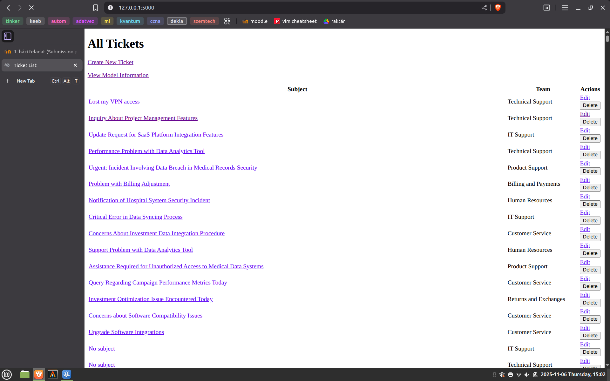
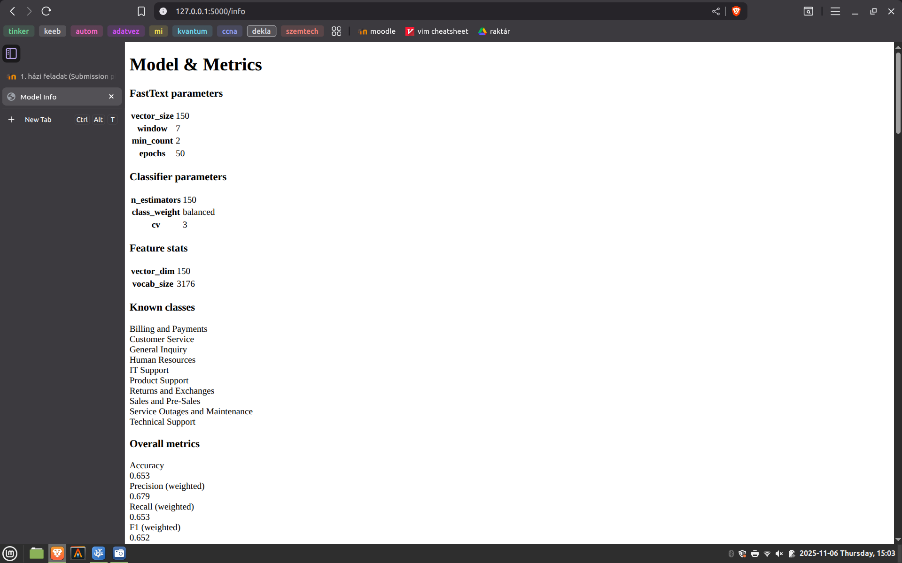
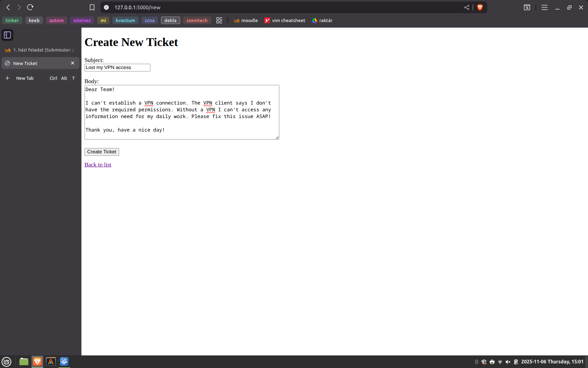
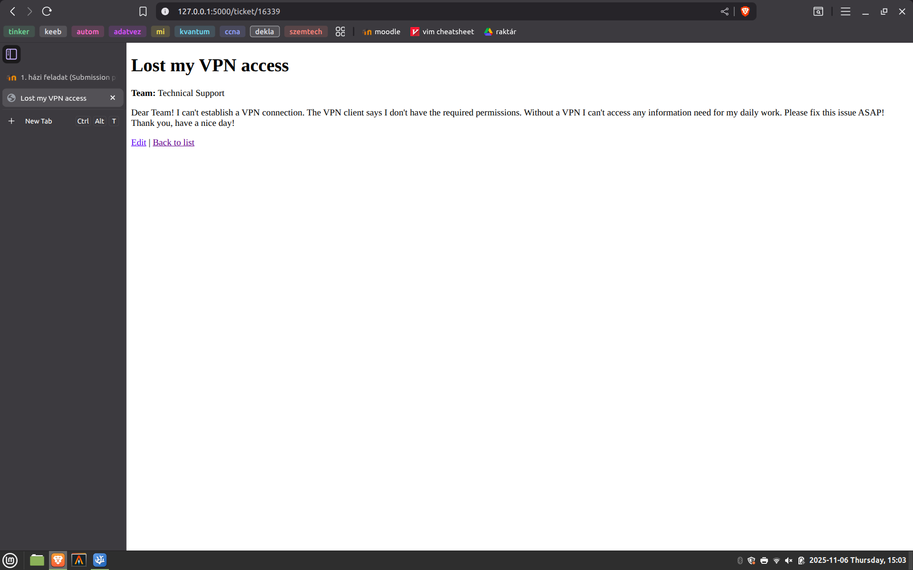
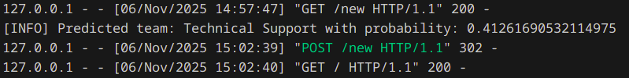

# Házifeladat beszámoló

## Feladat ismertetése

A házifeladatom célja az volt, hogy egy olyan osztályozó modellt készítsek, ami informatikai problémák szöveges leírásából képes meghatározni viszonylag jó pontossággal, hogy azzal melyik csapatnak kell foglalkoznia, kihez kerüljön a hibajegy.

## Felhasznált adatok

A betanításhoz felhasznált adatokat [innen](https://www.kaggle.com/datasets/tobiasbueck/multilingual-customer-support-tickets) töltöttem le, de csak az angol nyelvű leírásokat használtam fel (mivel németül nem tudok).

A feladat szempontjából tulajdonképpen csak a `body` és `queue` adatok érdekesek, de a `subject`-et is felhasználtam, hogy kicsit áttekinthetőbb legyen a felhasználói felület. A `body` a probléma szöveges leírása, a `queue` pedig a csapat, aki a hibajeggyel foglalkozik/foglalkozott.

## Applikáció ismertetése

Szerettem volna, hogy az osztályozó modellel kényelmesen lehessen interaktálni, ezért készítettem köré egy minimális applikációt is az SQLite és Flask könyvtárak segítségével.

Az adatbázis összesen egy darab `tickets` táblát tartalmaz, ami tárolja a hibajegyek hasznos adatait, illetve egy egyedi azonosítót, hogy az egyes hibajegyekre lehessen hivatkozni is.

A Flask által használt HTML templateket a ChatGPT-vel generáltattam le, mivel ez a házi feladat szempontjából teljesen lényegtelen. A Flask applikáció tölti be az osztályozó modellt és futtatja az oszályozást, mikor a felhasználó egy új hibajegyet hoz lére.

A felhasználói felület így néz ki:






## Modell ismertetése

A nyelvfeldolgozó pipeline az alábbi lépésekből áll:

1. Adatok (szöveges leírás, hozzárendelt csapat) lekérdezése az adatbázisból
2. Szöveges leírások tokenizálása (token = szó)
3. Stopword szűrés
4. Szótövesítés
5. Szóbeágyazások készítése a szótövekből
6. Oszályozó modell tanítása a szóbeágyazásokból és csapatokból
7. Csapatok hozzárendelése a szóbeágyazásokhoz.

### Tokenizálás, stopword szűrés és szótövesítés

Tokenizálás `regEx` és az `nltk` felhasználásával:

``` python
# preprocess.py
def tokenize(text):
    text = re.sub(r'\\[nrtbv]+', ' ', text)  
    text = re.sub(r'[^a-zA-Z\s]', ' ', text)  
    text = re.sub(r'\s+', ' ', text)
    return [token.lower() for token in word_tokenize(text)]
```

Stopword szűrés manuálisan megadott szavakkal és az `nltk` felhasználásával:

``` python
# preprocess.py
def get_domain_stopwords():
    return {
        'dear', 'team', 'hello', 'hi', 'please', 'thanks', 'thank', 'regards',
        'issue', 'problem', 'help', 'support', 'service', 'ticket', 'request',
        'hello', 'hi', 'hey', 'thanks', 'thank', 'please', 'regards', 'best',
        'kind', 'looking', 'forward', 'hello', 'hi', 'dear', 'sir', 'madam',
        'email', 'phone', 'call', 'contact', 'regarding', 'following'
    }

def without_stopwords(tokens, language = 'english'):
    return [token for token in tokens if (token not in set(stopwords.words(language)) and token not in list(string.punctuation) and token not in get_domain_stopwords())]
```

Lemmatizálás `WordNet`-tel:

``` python
# preprocess.py
def get_wordnet_pos(tag):
    if tag.startswith('J'):  
        return 'a'
    elif tag.startswith('V'):  
        return 'v'
    elif tag.startswith('N'):  
        return 'n'
    elif tag.startswith('R'):  
        return 'r'
    else:
        return 'n'

def lemmatize(tokens, lemmatizer = WordNetLemmatizer()):
    return [lemmatizer.lemmatize(token, get_wordnet_pos(tag)) for (token, tag) in pos_tag(tokens)]
```

Ezeket a technikákat jobban nem részletezem, mert mindegyik volt órai gyakorlaton is és a kód magáért beszél.

### Szóbeágyazó modell tanítása, dokumentum vektor képzése

A szóbeágyazáshoz `FastText`-et használok, amit az előfeldolgozott adatokon tanítok be.

``` python
# classify.py
def train_fasttext(clean_docs, vector_size=150, window=7, min_count=2, epochs=50):
    model = FastText(vector_size=vector_size, window=window, min_count=min_count, sg=1)
    model.build_vocab(clean_docs)
    model.train(clean_docs, total_examples=len(clean_docs), epochs=epochs)
    return model
```

Mivel a `FastText` csak egy adott tokent tud beágyazni és a szöveges leírások sok tokenből állnak, ezért valamilyen módon képezni kell egy olyan vektort, ami az egész szöveges leírást reprezentálja. Ezt úgy csinálom, hogy az egyes tokenek vektorainak mediánját veszem.

``` python
# vector.py
def of(tokens, model):
    word_vectors = []
    for token in tokens:
        if token in model.wv:
            word_vectors.append(model.wv[token])
    
    if word_vectors:
        return np.mean(word_vectors, axis=0)
    else:
        return np.zeros(model.vector_size)
```

### Osztályozó modell tanítása

Osztályozó modellnek végül `RandomForestClassifier`-t választottam, mert ez adta a legjobb eredményeket, de ezeket próbáltam még:

- `SVC`
- `LogisticRegression`

`RandomForest` tanítása:

``` python
def train_classifier(X, y):
    clf = RandomForestClassifier(n_estimators=150, random_state=42, class_weight='balanced')
    calib = CalibratedClassifierCV(estimator=clf, cv=3)
    calib.fit(X, y)
    return calib
```

### Egyéb részletek a modellekről

Hogy ne kelljen minden újraindításnál újratanítani a modelleket, ezért a betanított modelleket és metrikáikat fájlokba cachelem és az applikáció onnan tölti be őket.

``` python
def save_models(ft_model, clf, metrics, ft_path=FT_MODEL_PATH, clf_path=CLF_PATH, metrics_path=METRICS_PATH):
    os.makedirs(os.path.dirname(ft_path), exist_ok=True)
    ft_model.save(ft_path)
    with open(clf_path, "wb") as fh:
        pickle.dump(clf, fh)
    with open(metrics_path, "w") as mh:
        json.dump(metrics, mh, indent=2)
    print(f"[INFO] Saved FastText to {ft_path}")
    print(f"[INFO] Saved classifier to {clf_path}")
 
def load_models():
    if not os.path.exists(FT_MODEL_PATH):
        raise FileNotFoundError(f"FastText model not found: {FT_MODEL_PATH}")
    if not os.path.exists(CLF_PATH):
        raise FileNotFoundError(f"Classifier not found: {CLF_PATH}")
    if not os.path.exists(METRICS_PATH):
        raise FileNotFoundError(f"Metrics not found: {METRICS_PATH}")

    ft = FastText.load(FT_MODEL_PATH)
    with open(CLF_PATH, "rb") as fh:
        clf = pickle.load(fh)
    with open(METRICS_PATH, "r") as mh:
        metrics = json.load(mh)
    return ft, clf, metrics   print(f"[INFO] Saved metrics to {metrics_path}")
```

A modellek metrikáinak és információinak kinyerésére is készítettem egy interfacet, hogy az applikációban kényelmesen megjeleníthető legyen.

``` python
def info(ft_model, clf, metrics):
    return {
        "fasttext_params": {
            "vector_size": ft_model.vector_size,
            "window": ft_model.window,
            "min_count": ft_model.min_count,
            "epochs": ft_model.epochs
        },
        "classifier_params": {
            "n_estimators": clf.estimator.n_estimators,
            "class_weight": clf.estimator.class_weight,
            "cv": clf.cv
        },
        "feature_stats": {
            "vector_dim": ft_model.vector_size,
            "vocab_size": len(ft_model.wv),
        },
        "classes": clf.classes_.tolist(),
        "metrics": metrics
    }
```

### Csapat meghatározása szöveges leírás alapján

A modell a csapatot úgy határozza meg, hogy a szöveges leírásból a szóbeágyazó modell készít egy vektort, a korábban már ismertetett módon. Ezt a vektort átadja az osztályozó modellnek, ami meghatározza az összes osztály valószínűségét és azt választja ki, amelyik valószínűsége a legnagyobb.

Megadható egy határ is a modellenk (0 és 1 közti valós szám), ami lekorlátozza a modellt, hogy csak akkor adjon választ, ha a határnál nagyobb valószínűségű a legnagyobb valószínűségű osztály.

``` python
def team(text, ft_model, clf, threshold=0.4):
    lemmas = preprocess.this(text)
    vec = vector.of(lemmas, ft_model)
    X = np.array([vec])  
    probs = clf.predict_proba(X)[0]
    classes = list(clf.classes_)
    probs_dict = {cls: float(p) for cls, p in zip(classes, probs)}
    top_idx = int(np.argmax(probs))
    top_cls = classes[top_idx]
    top_prob = float(probs[top_idx])

    if top_prob >= threshold:
        return top_cls, top_prob, probs_dict
    return None, top_prob, probs_dict
```

## Futási példa és értékelés

A parancsok futtatása előtt navigáljunk el a projekt gyökér könyvtárába. Az applikáció indítása előtt telepítsük a szükséges könyvtárakat, ezzel a paranccsal: `pip install -r requirements.txt`. Majd az applikációt ezzel a paranccsal indíthatjuk el: `python src/app.py`.

Ilyenkor, ha még nem létezik az adatbázis, létrehozza azt és feltölti az adatokkal. Ha pedig a modellek sem léteznek, akkor betanítja azokat és elmenti őket, hogy legközelebbi indításnál ne kelljen újratanítani.

Ha mégis újra szeretnénk tanítani a modellt, akkor a főoldalon a `Train Model` gombra kattintva megtehetjük.

Létrehoztam egy új hibajegyet az applikációban:


A modell a Technical Support csapatot rendelte hozzá a leírás alapján. Az összes osztály közül ennek 41% valószínűséget számított ki.




A modell összességében 65,3% pontossággal tudja megmondani a helyes csapatot. Ez szerintem egy egész jó eredmény, hiszen 10 csapat közül kell választania. Nem vagyok vele teljesen elégedett, de szerintem ez már elég jó ahhoz, hogy csökkentse a manuális hibajegy oda-vissza tologatást. Persze emberi felülvizsgálatra és beavatkozásra, amikor téved a modell továbbra is szükség van.

## Felhasznált források

- ChatGPT:
  - HTML templatek generálása a Flask applikációhoz
  - Python könyvtár ajánlások
  - Stack tracek megmagyarázása
- [NLTK Documentation](https://www.nltk.org/api/nltk.html)
- [WordNet Documentation](https://www.nltk.org/howto/wordnet.html)
- [Gensim FastText Documentation](https://radimrehurek.com/gensim/models/fasttext.html)
- [scikit RandomForestClassifier Documentation](https://scikit-learn.org/stable/modules/generated/sklearn.ensemble.RandomForestClassifier.html)
- Órai gyakorlatok forráskódjai
